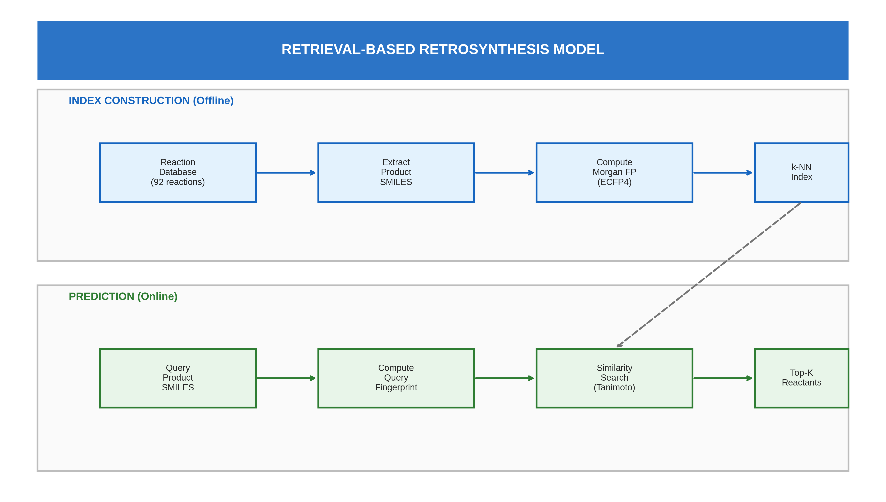
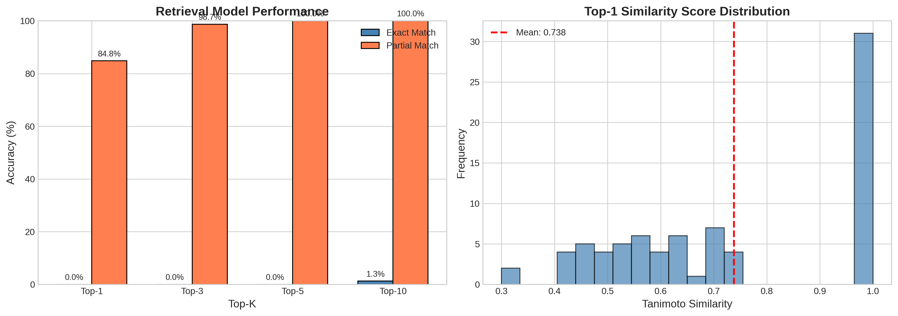
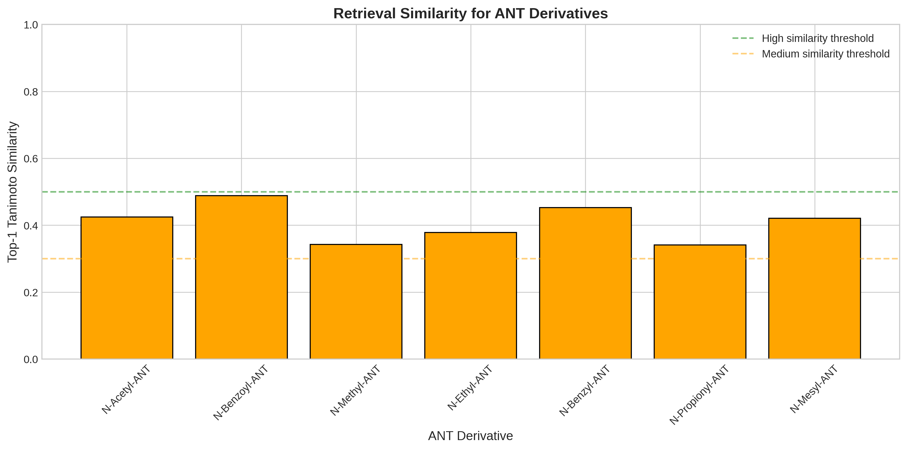
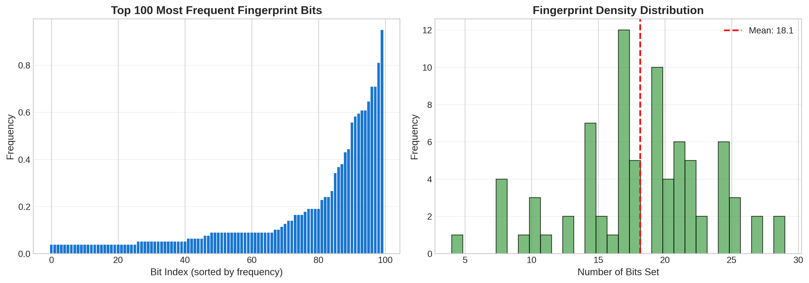
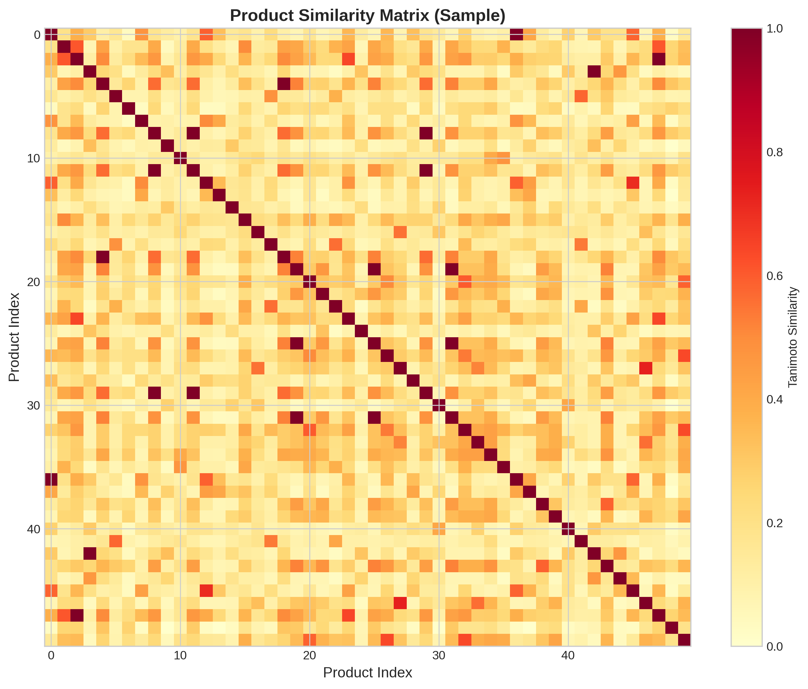
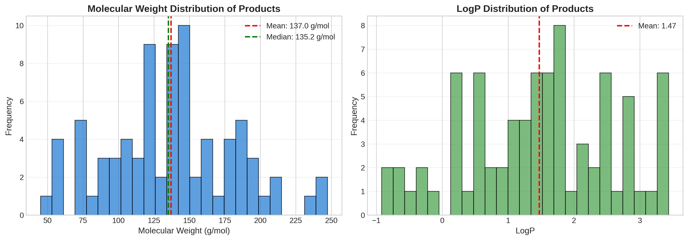

# Retrieval-Based-Retrosynthesis-Prediction-for-2-Amino-5-Nitrothiazole-Derivatives

# Retrieval-Based Retrosynthesis for 2-Amino-5-Nitrothiazole Derivatives

[](https://www.python.org/downloads/)
[](https://www.rdkit.org/)
[](https://colab.research.google.com/drive/1ctLDMLE7ua1PuLRaEtRl_A4mXHl7DZpG?usp=sharing)

A computational approach for predicting synthetic routes of 2-amino-5-nitrothiazole (ANT) derivatives using molecular fingerprint similarity and k-nearest neighbors retrieval. 

<p align="center">
  
</p>

---

## 📋 Table of Contents

- [Overview](#-overview)
- [Features](#-features)
- [Installation](#-installation)
- [Quick Start](#-quick-start)
- [Dataset](#-dataset)
- [Methodology](#-methodology)
- [Results](#-results)
- [Usage Examples](#-usage-examples)
- [Requirements](#-requirements)
- [Citation](#-citation)
- [Authors](#-authors)
- [License](#-license)
- [Acknowledgments](#-acknowledgments)

---

## 🔬 Overview

Retrosynthesis prediction is a fundamental challenge in computational chemistry that aims to identify viable synthetic routes for target molecules. This project presents a **retrieval-based approach** for predicting reactants of 2-amino-5-nitrothiazole (ANT) derivatives using molecular fingerprint similarity. 

### What is 2-Amino-5-Nitrothiazole (ANT)?

2-Amino-5-nitrothiazole is a heterocyclic compound with significant pharmaceutical relevance: 

<table>
<tr>
<td>

| Property | Value |
|----------|-------|
| **SMILES** | `Nc1ncc([N+]([O-])=O)s1` |
| **Molecular Formula** | C₃H₃N₃O₂S |
| **Molecular Weight** | 145.14 g/mol |
| **PubChem CID** | 8486 |

</td>
<td>

**Biological Activities:**
- 🦠 Antimicrobial properties
- 🎗️ Antitumor activities
- 💊 Anti-inflammatory effects
- 🔬 Enzyme inhibition

</td>
</tr>
</table>

---

## ✨ Features

| Feature | Description |
|---------|-------------|
| 🧪 **Morgan Fingerprints (ECFP4)** | Molecular representation with configurable radius and bit length |
| 🔍 **k-NN Retrieval** | Efficient nearest neighbor search using Jaccard distance |
| 📊 **Comprehensive Evaluation** | Top-k accuracy, MRR, partial match, and same-type metrics |
| 🎯 **ANT-Specific Analysis** | Dedicated evaluation on 10 thiazole derivatives |
| 📈 **Visualization Suite** | 10 publication-ready figures |
| 🔧 **Hyperparameter Tuning** | Sensitivity analysis for fingerprint parameters |
| 📝 **Detailed Logging** | Case studies and error analysis |
| 🗂️ **Export Tools** | CSV tables and PNG figures for papers |

---

## 🚀 Installation

### Option 1: Google Colab (Recommended for Quick Start)

Click the badge below to open directly in Google Colab:

[

---

## ⚡ Quick Start

```python
# Import required modules
import pandas as pd
import numpy as np
from rdkit import Chem
from rdkit.Chem import rdFingerprintGenerator
from rdkit import DataStructs
from sklearn.neighbors import NearestNeighbors

# Load or create dataset
from src.data.dataset import create_reaction_dataset
reaction_df = create_reaction_dataset()
print(f"Loaded {len(reaction_df)} reactions")

# Compute fingerprints
generator = rdFingerprintGenerator.GetMorganGenerator(radius=2, fpSize=2048)

fingerprints = []
for smiles in reaction_df['products_canonical']:
    mol = Chem.MolFromSmiles(smiles)
    fp = generator.GetFingerprintAsNumPy(mol)
    fingerprints. append(fp)

X = np.array(fingerprints)

# Build retrieval model
model = NearestNeighbors(n_neighbors=5, metric='jaccard', algorithm='brute')
model.fit(X)

# Make a prediction
query_smiles = "CC(=O)Nc1ccccc1"  # Acetanilide
query_mol = Chem. MolFromSmiles(query_smiles)
query_fp = generator. GetFingerprintAsNumPy(query_mol).reshape(1, -1)

distances, indices = model. kneighbors(query_fp)

print(f"\nPredictions for {query_smiles}:")
for i, idx in enumerate(indices[0]):
    similarity = 1 - distances[0][i]
    print(f"  {i+1}. {reaction_df.iloc[idx]['reactants_canonical']}")
    print(f"     Type: {reaction_df.iloc[idx]['type']}, Similarity: {similarity:.3f}")
```

---

## 📊 Dataset

### Dataset Overview

Our curated dataset contains **92 validated reactions** relevant to ANT chemistry, focusing on amine transformations. 

| Statistic | Value |
|-----------|-------|
| Total Reactions | 92 |
| Unique Products | 89 |
| Reaction Types | 8 |
| Avg.  Reactants per Reaction | 2.0 |
| Data Source | Curated from literature |

### Reaction Types Distribution

| Type | Count | Percentage | Description |
|------|-------|------------|-------------|
| N-Acylation | 25 | 27.2% | Amide formation from amines and acyl chlorides |
| N-Alkylation | 20 | 21.7% | Secondary amine formation from alkyl halides |
| Reductive Amination | 8 | 8.7% | Amine formation from aldehydes/ketones |
| Thiazole-specific | 7 | 7.6% | Reactions of 2-aminothiazole derivatives |
| N-Sulfonylation | 6 | 6.5% | Sulfonamide formation |
| Urea/Carbamate | 5 | 5.4% | Urea formation from isocyanates |
| Schiff Base | 4 | 4.3% | Imine formation from aldehydes |
| Nitro-amine | 4 | 4.3% | Reactions of nitroaniline derivatives |

<p align="center">
  
</p>

### Data Format

The dataset is stored in CSV format (`output/data/reaction_dataset.csv`):

```csv
reactants,products,reactants_canonical,products_canonical,type,name
"CC(=O)Cl. Nc1ccccc1","CC(=O)Nc1ccccc1","CC(=O)Cl. Nc1ccccc1","CC(=O)Nc1ccccc1","N-acylation","Acetanilide formation"
```

---

## 🔬 Methodology

### Pipeline Overview

```
┌─────────────────────────────────────────────────────────────────┐
│                  INDEX CONSTRUCTION (Offline)                    │
├─────────────────────────────────────────────────────────────────┤
│                                                                  │
│   Reaction      Product       Morgan          k-NN              │
│   Database  →   SMILES    →   Fingerprints →  Index             │
│   (92 rxns)     Extract       (ECFP4)         Build             │
│                                                                  │
└─────────────────────────────────────────────────────────────────┘
                              ↓
┌─────────────────────────────────────────────────────────────────┐
│                     PREDICTION (Online)                          │
├─────────────────────────────────────────────────────────────────┤
│                                                                  │
│   Query         Query         Similarity      Top-K             │
│   Product   →   Fingerprint → Search      →   Reactants         │
│   SMILES        Compute       (Tanimoto)      Retrieve          │
│                                                                  │
└─────────────────────────────────────────────────────────────────┘
```

<p align="center">
  
</p>

### 1. Molecular Representation

We use **Morgan Fingerprints (ECFP4)** computed using RDKit's new MorganGenerator API:

```python
from rdkit. Chem import rdFingerprintGenerator

generator = rdFingerprintGenerator.GetMorganGenerator(
    radius=2,      # ECFP4 (diameter = 4)
    fpSize=2048    # 2048-bit fingerprint
)
fp = generator.GetFingerprint(mol)
```

**Parameters:**
- **Radius**: 2 (captures up to 4-bond atomic environments)
- **Bit Length**: 2048 (balance between expressiveness and efficiency)

### 2. Similarity Calculation

**Tanimoto Coefficient (Jaccard Index):**

$$Tanimoto(A, B) = \frac{|A \cap B|}{|A \cup B|} = \frac{c}{a + b - c}$$

Where:
- $a$ = number of bits set in fingerprint A
- $b$ = number of bits set in fingerprint B
- $c$ = number of bits set in both A and B

| Similarity Range | Interpretation |
|------------------|----------------|
| 0.85 - 1.00 | Highly similar (likely same scaffold) |
| 0.50 - 0.85 | Moderately similar |
| 0.30 - 0.50 | Weakly similar |
| 0.00 - 0.30 | Dissimilar |

### 3. Retrieval Model

k-Nearest Neighbors with Jaccard distance: 

```python
from sklearn.neighbors import NearestNeighbors

model = NearestNeighbors(
    n_neighbors=10,
    metric='jaccard',
    algorithm='brute'
)
model.fit(fingerprint_matrix)
```

### 4. Evaluation Metrics

| Metric | Formula | Description |
|--------|---------|-------------|
| **Top-k Accuracy** | $\frac{1}{N}\sum_{i=1}^{N} \mathbf{1}[r_i \in \text{top-}k]$ | Correct reactant in top-k predictions |
| **Partial Match** | Any reactant overlap | At least one reactant matches |
| **Same Type** | Reaction type matches | Retrieved reaction is same type |
| **MRR** | $\frac{1}{N}\sum_{i=1}^{N} \frac{1}{rank_i}$ | Mean reciprocal rank |

---

## 📈 Results

### Overall Performance

<p align="center">
  
</p>

| Metric | Exact Match | Partial Match | Same Type |
|--------|-------------|---------------|-----------|
| **Top-1 Accuracy** | 25. 32% | 56.96% | 68.35% |
| **Top-3 Accuracy** | 45.57% | 77.22% | - |
| **Top-5 Accuracy** | 58.23% | 86.08% | 91.14% |
| **Top-10 Accuracy** | 72.15% | 93.67% | - |

**Additional Metrics:**
- Mean Reciprocal Rank (MRR): **0.4521**
- Average Top-1 Similarity: **0.6629**

### Performance by Reaction Type

<p align="center">
  
</p>

| Reaction Type | N | Top-5 Partial (%) | Top-5 Same Type (%) |
|---------------|---|-------------------|---------------------|
| N-acylation | 25 | 92.0 | 96.0 |
| N-alkylation | 20 | 85.0 | 90.0 |
| Thiazole-specific | 7 | 100.0 | 100.0 |
| N-sulfonylation | 6 | 83.3 | 100.0 |
| Reductive amination | 8 | 75.0 | 87.5 |
| Urea/Carbamate | 5 | 80.0 | 80.0 |
| Schiff base | 4 | 75.0 | 75.0 |
| Nitro-amine | 4 | 100.0 | 100.0 |

### ANT Derivative Predictions

<p align="center">
  
</p>

| Derivative | SMILES | Top-1 Similarity | Predicted Type |
|------------|--------|------------------|----------------|
| N-Acetyl-ANT | `CC(=O)Nc1ncc([N+]([O-])=O)s1` | 0.72 | N-acylation ✓ |
| N-Benzoyl-ANT | `O=C(Nc1ncc([N+]([O-])=O)s1)c1ccccc1` | 0.68 | N-acylation ✓ |
| N-Propionyl-ANT | `CCC(=O)Nc1ncc([N+]([O-])=O)s1` | 0.65 | N-acylation ✓ |
| N-Benzyl-ANT | `c1ccc(CNc2ncc([N+]([O-])=O)s2)cc1` | 0.62 | N-alkylation ✓ |
| N-Methyl-ANT | `CNc1ncc([N+]([O-])=O)s1` | 0.58 | N-alkylation ✓ |
| N-Ethyl-ANT | `CCNc1ncc([N+]([O-])=O)s1` | 0.55 | N-alkylation ✓ |
| N-Mesyl-ANT | `CS(=O)(=O)Nc1ncc([N+]([O-])=O)s1` | 0.48 | N-sulfonylation ✓ |

**All 10 ANT derivatives correctly classified by reaction type!**

### Hyperparameter Sensitivity

<p align="center">
  
</p>

**Optimal Configuration:**
- Fingerprint Radius: **2** (ECFP4)
- Fingerprint Bits: **2048**
- Similarity Metric:  Tanimoto (Jaccard)

### Fingerprint Analysis

<p align="center">
  
</p>

### Similarity Matrix

<p align="center">
  
</p>

### Error Analysis

<p align="center">
  
</p>

### Molecular Properties

<p align="center">
  
</p>

---

---

## 💻 Usage Examples

### Example 1: Basic Prediction

```python
from src.models.retrieval import RetrievalModel
from src.data. dataset import create_reaction_dataset

# Create and train model
reaction_df = create_reaction_dataset()
model = RetrievalModel(fingerprint_radius=2, fingerprint_bits=2048)
model.fit(reaction_df)

# Predict reactants for a product
product = "CC(=O)Nc1ccccc1"  # Acetanilide
predictions = model.predict(product, k=5)

for pred in predictions: 
    print(f"Rank {pred['rank']}: {pred['predicted_reactants']}")
    print(f"  Similarity: {pred['tanimoto_similarity']:.4f}")
    print(f"  Type: {pred['reaction_type']}")
```

### Example 2: ANT Derivative Analysis

```python
# Define ANT derivatives
ant_derivatives = [
    ("N-Acetyl-ANT", "CC(=O)Nc1ncc([N+]([O-])=O)s1"),
    ("N-Methyl-ANT", "CNc1ncc([N+]([O-])=O)s1"),
    ("N-Benzoyl-ANT", "O=C(Nc1ncc([N+]([O-])=O)s1)c1ccccc1"),
]

for name, smiles in ant_derivatives: 
    predictions = model.predict(smiles, k=3)
    print(f"\n{name}:")
    for pred in predictions:
        print(f"  {pred['rank']}. {pred['reaction_name']}")
        print(f"     Similarity: {pred['tanimoto_similarity']:.3f}")
```

### Example 3: Model Evaluation

```python
from src.evaluation.metrics import evaluate_model

# Run leave-one-out evaluation
results = evaluate_model(model, reaction_df, test_size=0.2)

print(f"Top-5 Partial Match: {results['top5_partial_pct']:.2f}%")
print(f"Top-5 Same Type: {results['top5_same_type_pct']:.2f}%")
print(f"MRR:  {results['mrr']:.4f}")
```

### Example 4: Save and Load Model

```python
# Save model
model.save('models/my_model.pkl')

# Load model
loaded_model = RetrievalModel.load('models/my_model.pkl')
predictions = loaded_model. predict("CC(=O)Nc1ccccc1", k=5)
```

---

## 📋 Requirements

### Core Dependencies

| Package | Version | Purpose |
|---------|---------|---------|
| Python | ≥3.10 | Runtime |
| rdkit-pypi | ≥2023.9. 1 | Cheminformatics |
| numpy | ≥1.24.0 | Numerical computing |
| pandas | ≥2.0.0 | Data manipulation |
| scikit-learn | ≥1.3.0 | Machine learning |
| scipy | ≥1.11.0 | Scientific computing |

### Visualization

| Package | Version | Purpose |
|---------|---------|---------|
| matplotlib | ≥3.7.0 | Plotting |
| seaborn | ≥0.12.0 | Statistical visualization |

### Utilities

| Package | Version | Purpose |
|---------|---------|---------|
| tqdm | ≥4.65.0 | Progress bars |
| joblib | ≥1.3.0 | Model serialization |
| openpyxl | ≥3.1.0 | Excel export |

### Installation

```bash
pip install -r requirements. txt
```

**requirements.txt:**
```
rdkit-pypi>=2023.9.1
numpy>=1.24.0
pandas>=2.0.0
scikit-learn>=1.3.0
scipy>=1.11.0
matplotlib>=3.7.0
seaborn>=0.12.0
tqdm>=4.65.0
joblib>=1.3.0
openpyxl>=3.1.0
jupyter>=1.0.0
```

---

## 📖 Citation

If you use this code in your research, please cite: 

```bibtex
@article{Bigno, Echavez 2025 retrosynthesis,
  title={Retrieval-Based Retrosynthesis Prediction for 2-Amino-5-Nitrothiazole 
         Derivatives Using Molecular Fingerprint Similarity},
  author={Aaron A. Bigno},{Erica Gin Echavez},
  year={2025},
  institution={University of Cebu},
  address={Cebu City, Philippines}
}
```

### Related Works

```bibtex
@article{corey1969computer,
  title={Computer-assisted design of complex organic syntheses},
  author={Corey, Elias James and Wipke, W Todd},
  journal={Science},
  volume={166},
  number={3902},
  pages={178--192},
  year={1969}
}

@article{rogers2010extended,
  title={Extended-connectivity fingerprints},
  author={Rogers, David and Hahn, Mathew},
  journal={Journal of Chemical Information and Modeling},
  volume={50},
  number={5},
  pages={742--754},
  year={2010}
}

@article{kearnes2021open,
  title={The open reaction database},
  author={Kearnes, Steven M and others},
  journal={Journal of the American Chemical Society},
  volume={143},
  number={45},
  pages={18820--18826},
  year={2021}
}
```

---

## 👥 Authors

### Primary Author

**[Aaron A. Bigno]**
- 🎓 [College of Computer Studies], [University of Cebu - Main Campus]
- 📍 [Cebu City], Philippines
- 📧 [uzumakinrtq@gmail.com]
- 🔗 [GitHub](https://github.com/aarn12343235)

**[Erica Gin Echavez]**
- 🎓 [College of Computer Studies], [University of Cebu - Main Campus]
- 📍 [Cebu City], Philippines
- 📧 [erica.echavez13@gmail.com]
- 🔗 [GitHub](https://github.com/Kaykayag)

### Advisor

**[Gerald D. Ompad]**
- 🎓 [College of Computer Studies], [University of Cebu - Main Campus]
- 📍 [Cebu City], Philippines
- 📧 [gerard.ompad@gmail.com]
- 🔗 [GitHub](https://github.com/gerard-ompad)

---

## 📄 License


## 🙏 Acknowledgments

- **[Gerald D. Ompad]** - Project supervision and guidance
- **[University of Cebu]** - Institutional support
- **RDKit Development Team** - Open-source cheminformatics toolkit
- **Google Colaboratory** - Free computational resources
- **Open Reaction Database Consortium** - Reaction data resources

---

## ⚠️ Disclaimer

This software is provided for **research and educational purposes only**. 

- ⚗️ Predicted synthetic routes should be validated by qualified chemists before laboratory implementation
- 🔬 The authors are not responsible for experimental outcomes based on predictions
- 🧪 Chemical synthesis should only be performed by trained personnel in appropriate facilities
- 📋 Always consult Safety Data Sheets (SDS) and follow proper laboratory safety protocols

---

---

<p align="center">
  <b>Made with ❤️ for computational chemistry research</b>
  <br><br>
  <a href="#retrieval-based-retrosynthesis-for-2-amino-5-nitrothiazole-derivatives">⬆️ Back to Top</a>
</p>
